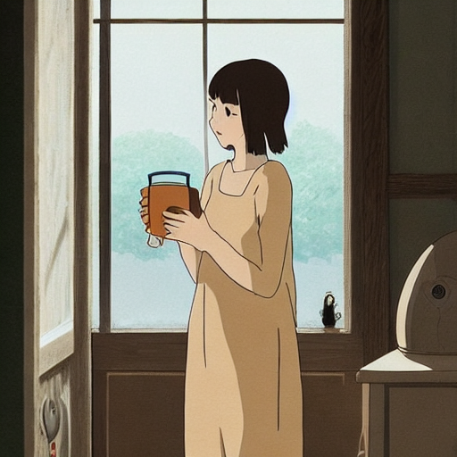
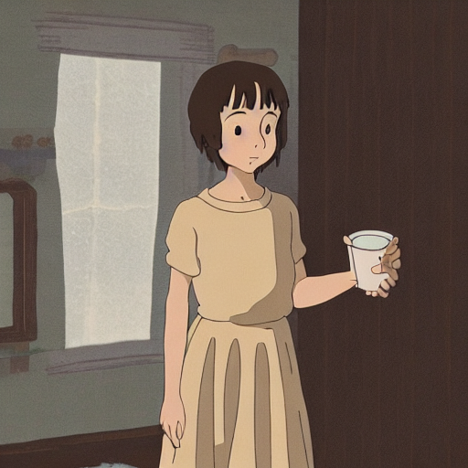
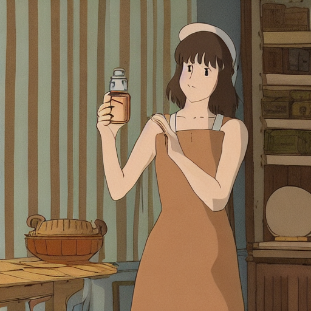
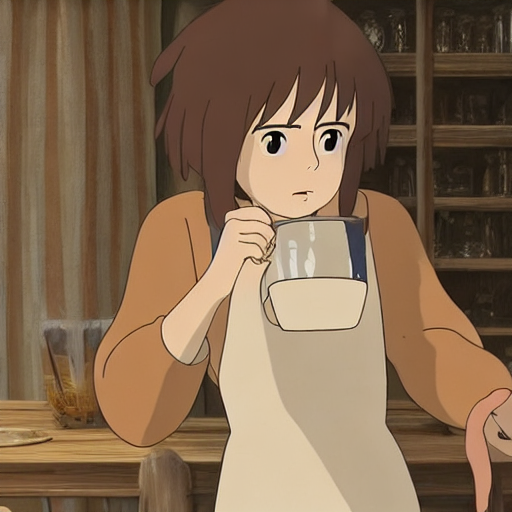
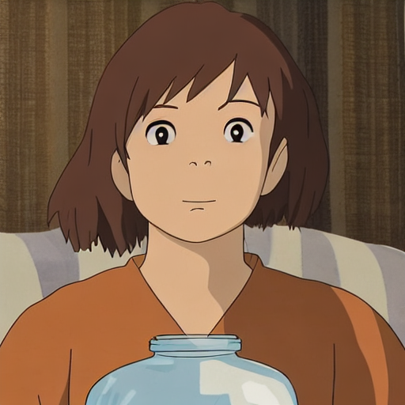
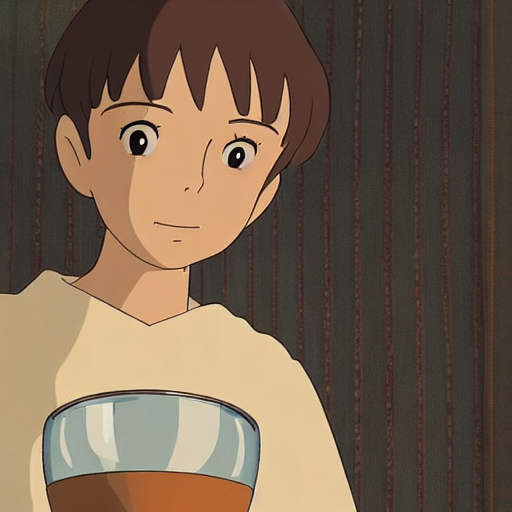
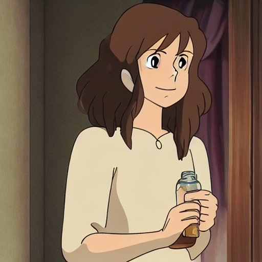
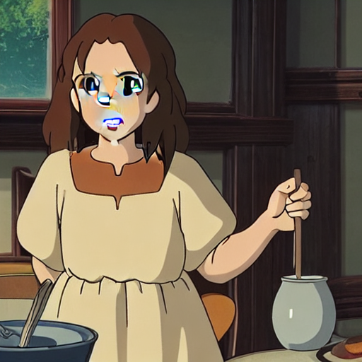
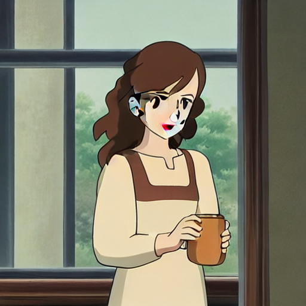
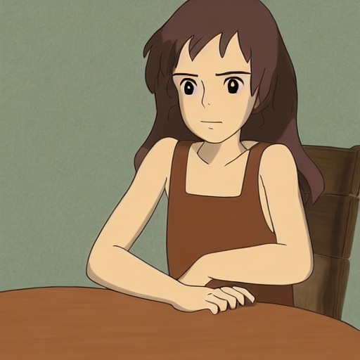

# Báo cáo công việc tuần 6 — Dự án LoRA Ghibli SD

## 1. Công việc đã thực hiện

1. Lọc ảnh theo các tiêu chí
- Loại bỏ ảnh có nhiều nhân vật
- Loại bỏ ảnh nhân vật bị mất chi tiết mắt, mũi, miệng. . .
- Loại bỏ ảnh nhân vật chỉ có bóng lưng
- Loại bỏ ảnh nhân vật quá nhỏ so với khung cảnh xung quanh
- Giữ tỉ lê nhân vật so với khung hình ổn định

-> Từ 4776 ảnh xuống còn 290 ảnh

2. Theo dõi việc huấn luyện mô hình bằng cách xem log ghi lại trên wandb

## 2. Kết quả

Ảnh vẫn gặp các vấn đề như:
- Chi tiết khuôn mặt bị mất hoặc thể hiện thiếu rõ ràng.
- Một số góc mặt cho kết quả bị nhiễu hoặc không nhất quán.

## 3. Theo dõi validation

**Validation prompt:**

```
“Ghibli style a young woman with warm brown hair, a gentle smile on her face, wears a simple cream dress and brown tunic, carefully looking at a glass jar of water, in a cozy room with striped textiles and soft natural light.”
```

Số ảnh sinh ra mỗi lần validation: 4

Tổng số optimization steps = 29000

Tần suất validation: 290 steps 1 lần (Tức là cứ 290 steps thì có 4 ảnh được tạo ra từ câu prompt trên)

Folder ảnh validation được lưu tạm vào: reports\report_week6\images
nhưng sẽ khác nhau tuỳ thuộc địa chỉ local hiện lên trên log của terminal khi chạy mô hình, ngoài ra cũng được lưu lại trên wandb

Train loss khi huấn luyện


**Nhận xét:**
- Quá trình huấn luyện xuất hiện 1 vài ảnh đen do chưa tắt safety_checker
- Từ bước 190 đến 1470: Nét vẽ trang phục vẫn còn khá đơn giản. Khuôn mặt nhân vật thiếu chi tiết, mắt – mũi – miệng mờ hoặc không rõ ràng. Phần bàn tay bị mất chi tiết hoặc biến dạng trong nhiều ảnh.

<p float="left">
  
  
  
</p>

- Từ bước 2030 đến 3770: Chất lượng bắt đầu cải thiện rõ rệt. Đôi mắt và khuôn miệng được vẽ đẹp hơn, sắc nét và có cảm xúc hơn. Xuất hiện hiệu ứng đổ bóng (shading) mềm mại, mang phong cách hoạt hình Ghibli. Tóc của nhân vật cũng được thể hiện mượt và tự nhiên hơn. Tuy nhiên, trang phục vẫn giữ kiểu đơn giản, chưa nhiều chi tiết.
<p float="left">
  
  
  
</p>

- Từ bước 4000 trở đi,Bắt đầu xuất hiện hiện tượng mất chi tiết khuôn mặt (mắt, mũi, miệng), và tần suất tăng dần ở các bước sau — dấu hiệu của overfitting. Bù lại, tóc và trang phục trở nên chi tiết hơn, ổn định hơn. Đáng chú ý là tay nhân vật cũng ít bị biến dạng hơn so với giai đoạn trước.
Dù vậy, mô hình vẫn cho ra một số ảnh đẹp trong khoảng này, cho thấy thông tin phong cách được học khá tốt nhưng đặc trưng nhân vật bắt đầu bị mất.
<p float="left">
  
  
  
</p>

- Tại checkpoint thứ 5000: Ghi nhận lại ảnh được tạo ra như sau:
  


-> Có thể thấy rằng dù chưa hoàn hảo, checkpoint tại bước 5000 đã đạt mức cân bằng khá tốt giữa việc giữ chi tiết khuôn mặt, phong cách Ghibli và cấu trúc nhân vật. Khi số lượng dữ liệu tăng và mô hình học sâu hơn, chất lượng ảnh cải thiện ở phần chi tiết trang phục và tóc, tuy nhiên cần kiểm soát overfitting để giữ độ sắc nét của khuôn mặt.

### 4. Kết luận

Quá trình huấn luyện mô hình LoRA trên phong cách Ghibli cho thấy mô hình học phong cách khá tốt, đặc biệt ở các giai đoạn giữa (từ 2000–4000 steps). Một số điểm đáng chú ý:

- Mô hình tái hiện được hiệu ứng đổ bóng, cách phối màu và chất liệu đặc trưng của phong cách Ghibli.

- Các chi tiết tóc và trang phục dần trở nên mềm mại và tự nhiên hơn khi số bước huấn luyện tăng.

- Tuy nhiên, chi tiết khuôn mặt là điểm yếu rõ rệt, thường bị mờ, biến dạng hoặc mất hoàn toàn khi mô hình tiến về cuối quá trình (dấu hiệu overfitting).

- Bước 5000 được xem là một checkpoint “cân bằng tốt”: giữ lại chi tiết khuôn mặt ổn định, phong cách hợp lý và hạn chế lỗi.

Nhìn chung, mô hình đã nắm được phong cách tổng thể nhưng chưa học tốt các đặc trưng nhân vật (identity), đặc biệt là khuôn mặt.
