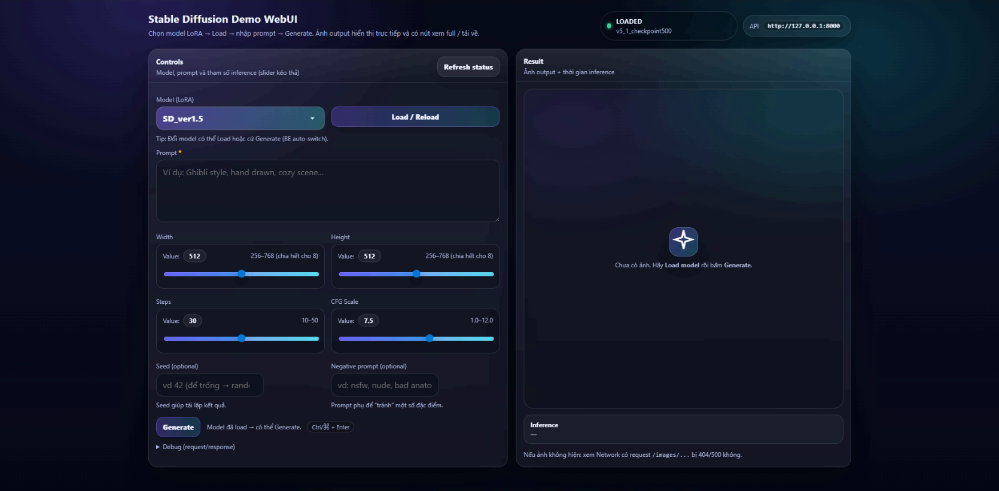
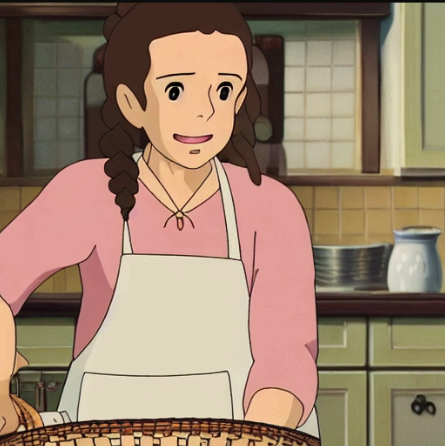
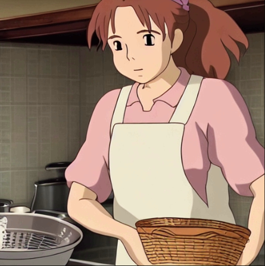

# Báo cáo công việc tuần 8 — Dự án LoRA Ghibli SD 
## Xây dựng và kiểm thử Web Demo Stable Diffusion

### 1. Mục tiêu tuần
Trong tuần 8, nhóm tập trung vào việc:
- Thiết kế và triển khai web demo cho mô hình Stable Diffusion (base + LoRA)
- Hoàn thiện luồng inference từ frontend đến backend
- Thực hiện kiểm thử web demo nhằm đánh giá tính ổn định, tính đúng đắn của chức năng sinh ảnh và chất lượng ảnh đầu ra

Kết quả của tuần này nhằm đảm bảo hệ thống sẵn sàng cho giai đoạn demo và báo cáo cuối kỳ.

---

## 2. Công nghệ sử dụng

### 2.1 Backend (API + Serve Static Files)

- **Python 3.10+**  
  Ngôn ngữ chính để triển khai backend và thực hiện inference cho mô hình Stable Diffusion.

- **FastAPI**  
  Framework web cho Python, được sử dụng để xây dựng REST API.  
  FastAPI hỗ trợ:
  - Validation request/response thông qua Pydantic
  - Trả lỗi rõ ràng (HTTP status code)
  - Dễ debug và mở rộng

- **Uvicorn**  
  ASGI server để chạy FastAPI.  
  Hỗ trợ `--reload` giúp tăng tốc độ phát triển và kiểm thử local.

- **Pydantic**  
  Định nghĩa schema và validation cho các input như:
  - Prompt
  - Width / Height
  - Steps
  - CFG Scale
  - Seed  
  Giúp chặn request không hợp lệ ngay từ backend (HTTP 400).

- **StaticFiles (FastAPI)**  
  Dùng để:
  - Serve ảnh output từ thư mục local thông qua route `/images/...`
  - Serve giao diện WebUI (HTML/CSS/JS) nếu frontend được mount chung domain với backend

---

### 2.2 Frontend (WebUI Demo)

- **HTML5**  
  Xây dựng layout trang web gồm:
  - Form nhập prompt
  - Dropdown chọn model
  - Khu vực hiển thị ảnh và trạng thái

- **CSS3**  
  Styling UI/UX:
  - Card layout
  - Gradient background
  - Button state (disabled / loading)
  - Slider style cho tham số inference

- **Vanilla JavaScript (ES Modules)**  
  Đảm nhiệm:
  - Gọi API backend bằng `fetch`
  - Quản lý trạng thái UI (`not_loaded`, `loading`, `loaded`, `running`, `failed`)
  - Disable / enable nút Generate
  - Build URL ảnh từ `imageUrl` backend trả về để hiển thị và download

- **Không sử dụng framework frontend**  
  Không dùng React/Vue để:
  - Giảm độ phức tạp
  - Tránh bước build
  - Đảm bảo demo chạy ngay khi mở file

---

### 2.3 Dev & Runtime (Local Demo)

- **pip + requirements.txt**  
  Quản lý dependency:
  - fastapi
  - uvicorn
  - torch
  - diffusers
  - safetensors
  - pillow

- **CORS Middleware**  
  - Bật khi frontend và backend chạy khác port
  - Không cần nếu frontend được mount trực tiếp vào backend

- **Logging (Python logging)**  
  Ghi log cho các sự kiện quan trọng:
  - Thời gian load base model
  - Thời gian load LoRA
  - Thời gian inference
  - Đường dẫn ảnh output
  - Exception trace để debug

---

## 3. Lý do lựa chọn stack công nghệ

- **FastAPI + Uvicorn**: nhẹ, nhanh, dễ debug, phù hợp cho demo và kiểm thử.
- **HTML/CSS/JS thuần**: triển khai nhanh, ít rủi ro, không phụ thuộc môi trường build.
- Stack này giúp nhóm tập trung vào **logic inference và kiểm thử model**, thay vì xử lý các vấn đề frontend phức tạp.

---

## 4. Cấu trúc thư mục đề xuất

### Back-end

```
software_product/backend/
├─ main.py
├─ api/
│ └─ routes.py
├─ services/
│ ├─ sd_service.py
│ └─ quick_nsfw_module.py
├─ schemas/
│ ├─ model.py
│ └─ inference.py
└─ core/
└─ config.py
```

### Front-end
```
software_product/web/
├─ index.html
└─ assets/
├─ styles.css
├─ api.js
├─ ui.js
└─ app.js
```
---

## 5. Cấu hình Backend

Trong `core/config.py`:

- `BASE_MODEL_ID`: `"runwayml/stable-diffusion-v1-5"`
- `BASE_MODELS`: danh sách base model hiển thị trên UI (ví dụ: `["SD_ver1.5"]`)
- `LORA_DIR`: thư mục chứa các file LoRA `.safetensors`
- `ROOT_IMAGE_DIR`: nơi lưu ảnh output
- `REINIT_PIPE_ON_LOAD`: quyết định việc recreate pipeline khi load model

---

## 6. API Backend (Contract)

### 6.1 GET `/api/models`
Trả danh sách model hiển thị trên web (base + LoRA).

### 6.2 GET `/api/model/status`
Trả trạng thái pipeline/model hiện tại.

### 6.3 POST `/api/model/load`
Load base model hoặc LoRA vào GPU và set model đang active.

### 6.4 POST `/api/generate`
Sinh ảnh từ prompt với các tham số inference và trả về:
- `imageUrl`
- `inferenceMs`
- `model`

---

## 7. Luồng hoạt động chính

### 7.1 Load model
- FE gọi `/api/models`
- User chọn model và bấm Load
- Backend load base hoặc LoRA tương ứng
- FE cập nhật trạng thái và bật nút Generate

### 7.2 Generate ảnh
- User nhập prompt và chỉnh tham số
- Backend validate input
- Thực hiện inference
- Lưu ảnh và trả URL cho frontend
- FE hiển thị ảnh và thời gian inference

---

## 8. Logging & Error Handling

- Backend log đầy đủ các bước load model và inference
- Trả lỗi HTTP 400 cho validation
- Trả lỗi HTTP 500 cho lỗi inference
- Frontend hiển thị thông báo lỗi rõ ràng, không crash UI

---

## 9. Kiểm thử Web Demo

### 9.1 Mục tiêu kiểm thử
Đánh giá:
- Tính ổn định của web demo
- Tính đúng đắn của chức năng sinh ảnh
- Chất lượng ảnh đầu ra

### 9.2 Phạm vi kiểm thử
- Load model LoRA
- Sinh ảnh từ prompt
- Giao diện người dùng
- Độ ổn định khi sử dụng liên tục
- Chất lượng ảnh sinh ra

### 9.3 Nội dung và kết quả kiểm thử

- Load / Reload model LoRA thành công, trạng thái hiển thị đúng (**LOADED**)
- Nhập prompt hợp lệ → sinh ảnh thành công
- Prompt rỗng hoặc không hợp lệ → hiển thị thông báo phù hợp
- Thay đổi Width / Height / Steps / CFG Scale hoạt động đúng
- Seed trống → kết quả ngẫu nhiên; seed cố định → kết quả lặp lại
- Ảnh output hiển thị đúng trên giao diện
- Hiển thị chính xác thời gian inference
- Nút Xem full và Download hoạt động đúng
- Sinh ảnh nhiều lần liên tiếp không gây lỗi
- Refresh trang không làm backend crash
- Ảnh sinh ra thể hiện đúng phong cách model đã fine-tune

---

### Minh họa giao diện Web Demo

**Giao diện tổng thể của web demo trong quá trình kiểm thử:**



---

### Minh họa kết quả sinh ảnh

**Ví dụ ảnh được sinh từ prompt hợp lệ với model LoRA đã fine-tune:**


*Hình 1: Kết quả sinh ảnh với prompt về nhân vật nữ trong bếp - thể hiện phong cách Ghibli với màu sắc ấm áp và chi tiết tinh tế*


*Hình 2: Ví dụ khác về khả năng sinh ảnh của model khác với cùng prompt*

> Prompt cho quá trình kiểm thử trên:  
> *"Ghibli style, anime, a girl with brown braided hair, wearing a light pink shirt and a white apron, stirring a pot with a happy expression, in a cozy kitchen with warm light and a woven basket nearby."*

---

### 9.4 Nhận xét
Web demo hoạt động ổn định, không ghi nhận lỗi nghiêm trọng trong quá trình kiểm thử. Hệ thống đáp ứng đầy đủ yêu cầu demo và đánh giá kết quả model.

---


## 10. Kết quả đạt được trong tuần

- Hoàn thiện web demo Stable Diffusion
- Load model và sinh ảnh ổn định
- Giao diện trực quan, dễ sử dụng
- Hoàn thành kiểm thử chức năng và độ ổn định

Tuần tiếp theo, nhóm sẽ tiếp tục:
- Hoàn thiện demo cuối cùng
- Chọn checkpoint LoRA tốt nhất để trình bày
- Hoàn thiện báo cáo tổng kết cuối kỳ
